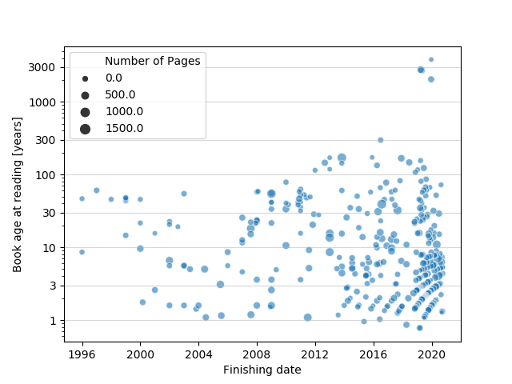

# GoodreadsExportVisualization
An improved visualization of the publication year / read year from Goodreads. Import your data using the page https://www.goodreads.com/review/import, and run the python script on the recieved CSV file.

